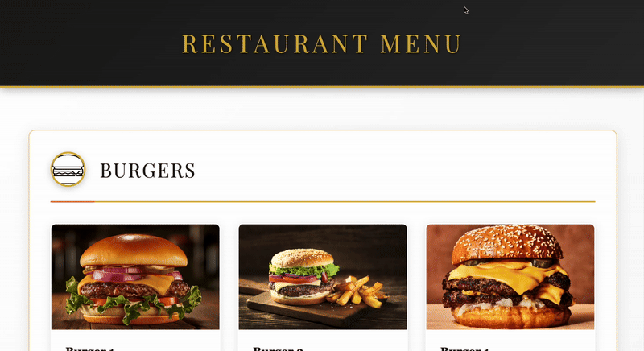
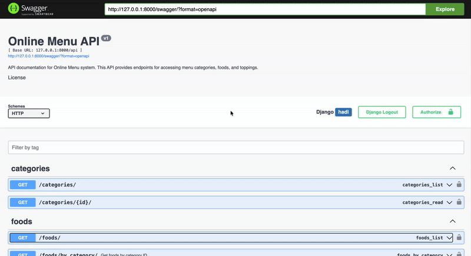
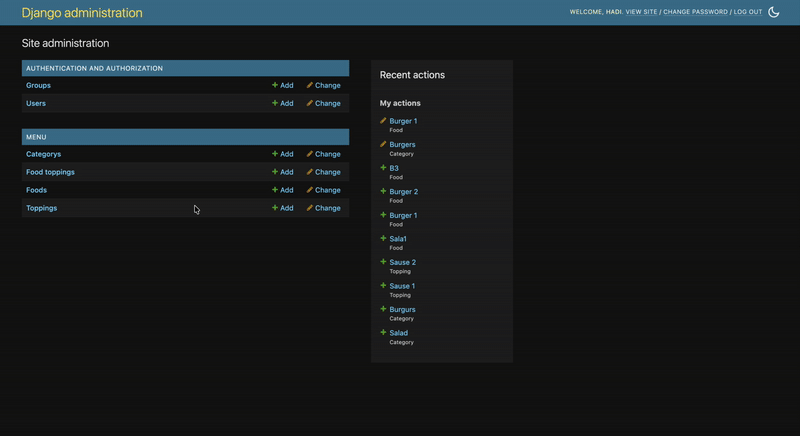

# Online Menu System

An online menu system built with Django tempaltes and Django REST Framework. Perfect for restaurants, cafes, and food establishments looking to showcase their menu digitally with a responsive interface and a API for frontend integration.



## Features

### Core Functionality
- Category-based Menu Organization - Organize foods by categories with custom icons
- Food Details - Each food item includes descriptions, multiple images, and pricing
- Topping System - Flexible topping management with individual pricing
- Discount Management - Apply percentage-based discounts to foods and toppings
- Time-based Availability - Set specific time windows when items are available
- Availability Status - Mark items as available/unavailable with visual indicators

### User Interface
- Responsive Design - Seamlessly works on desktop, tablet, and mobile devices
- Image Gallery - Interactive image slider with modal view for food details
- Real-time Pricing - Automatic calculation and display of discounted prices
- Visual Badges - Clear indicators for discounts and availability status
- Euro Currency - All prices displayed in Euro (€)
- Separated Assets - HTML, CSS, and JavaScript files are properly separated

### API & Integration
- RESTful API - Complete REST API built with Django REST Framework
- Swagger Documentation - Interactive API documentation with Swagger UI
- Advanced Filtering - Filter by category, availability, search by name/description
- Pagination - Efficient pagination for large datasets
- CORS Enabled - Ready for frontend integration



### Admin Panel
- Customized Admin Interface - Enhanced Django admin with image previews
- Rich Display - Visual indicators for discounts, availability, and pricing
- Inline Editing - Manage food images and toppings directly from food pages
- Comprehensive Filtering - Filter and search across all models



## Getting Started

### Prerequisites
- Python 3.8+
- pip
- Virtual environment (recommended)
- Docker and Docker Compose (optional, for containerized deployment)

### Installation

#### Option 1: Local Development

1. Clone the repository
   ```bash
   git clone <repository-url>
   cd online-menu
   ```

2. Create and activate virtual environment
   ```bash
   python -m venv .venv
   source .venv/bin/activate  # On Windows: .venv\Scripts\activate
   ```

3. Install dependencies
   ```bash
   pip install -r requirements.txt
   ```

4. Set up environment variables
   ```bash
   cp .env.example .env
   # Edit .env file with your configuration
   ```

5. Run migrations
   ```bash
   python manage.py makemigrations
   python manage.py migrate
   ```

6. Create superuser (optional, for admin access)
   ```bash
   python manage.py createsuperuser
   ```

7. Collect static files
   ```bash
   python manage.py collectstatic
   ```

8. Run development server
   ```bash
   python manage.py runserver
   ```

9. Access the application
   - Web Interface: http://127.0.0.1:8000/
   - Admin Panel: http://127.0.0.1:8000/admin/
   - API Documentation: http://127.0.0.1:8000/swagger/
   - ReDoc Documentation: http://127.0.0.1:8000/redoc/

#### Option 2: Docker Deployment

1. Clone the repository
   ```bash
   git clone <repository-url>
   cd online-menu
   ```

2. Set up environment variables
   ```bash
   cp .env.example .env
   # Edit .env file with your production configuration
   ```

3. Build and run with Docker Compose
   ```bash
   docker-compose up -d --build
   ```

4. Run migrations
   ```bash
   docker-compose exec web python manage.py migrate
   ```

5. Create superuser
   ```bash
   docker-compose exec web python manage.py createsuperuser
   ```

6. Collect static files
   ```bash
   docker-compose exec web python manage.py collectstatic --noinput
   ```

7. Access the application
   - Web Interface: http://localhost:8000/
   - Admin Panel: http://localhost:8000/admin/

#### Option 3: Docker (Standalone)

1. Build the Docker image
   ```bash
   docker build -t online-menu .
   ```

2. Run the container
   ```bash
   docker run -d \
     -p 8000:8000 \
     -e SECRET_KEY=your-secret-key \
     -e DEBUG=False \
     -e ALLOWED_HOSTS=your-domain.com \
     -e DB_ENGINE=django.db.backends.postgresql \
     -e DB_NAME=onlinemenu \
     -e DB_USER=onlinemenu \
     -e DB_PASSWORD=your-password \
     -e DB_HOST=your-db-host \
     -e DB_PORT=5432 \
     --name online-menu \
     online-menu
   ```

## CI/CD with GitHub Actions

This project includes GitHub Actions workflows for automated testing and deployment.

### Workflow Features
- **Automated Testing** - Runs test suite on every push and pull request
- **Database Testing** - Uses PostgreSQL service for integration tests
- **Docker Build** - Automatically builds and pushes Docker images on main branch
- **Multi-stage Pipeline** - Tests must pass before building Docker images

### Setting Up GitHub Actions

1. Add the following secrets to your GitHub repository:
   - `DOCKER_USERNAME` - Your Docker Hub username
   - `DOCKER_PASSWORD` - Your Docker Hub password or access token

2. The workflow will automatically:
   - Run tests on every push and pull request
   - Build and push Docker images when code is pushed to the main branch
   - Tag images with `latest` and commit SHA

### Workflow Triggers
- **Push to main/develop** - Runs tests and builds Docker images
- **Pull Requests** - Runs tests only (no Docker build)

## Testing

Run the comprehensive test suite:

```bash
python manage.py test
```

Or with Docker:

```bash
docker-compose exec web python manage.py test
```

The test suite includes:
- Model tests (creation, relationships, business logic, properties)
- View tests (template rendering, context data)
- API tests (endpoints, serialization, filtering)
- Utility function tests

## Production Deployment

### Environment Variables

Create a `.env` file with the following variables:

```env
SECRET_KEY=your-secret-key-here
DEBUG=False
ALLOWED_HOSTS=your-domain.com,www.your-domain.com

# PostgreSQL Database
DB_ENGINE=django.db.backends.postgresql
DB_NAME=onlinemenu
DB_USER=onlinemenu
DB_PASSWORD=your-secure-password
DB_HOST=db
DB_PORT=5432
```

### Security Checklist

Before deploying to production:

1. Set `DEBUG = False`
2. Configure proper `ALLOWED_HOSTS`
3. Use a strong `SECRET_KEY`
4. Set up proper database (PostgreSQL recommended)
5. Configure static file serving (handled by WhiteNoise)
6. Set up media file serving (consider AWS S3 or similar)
7. Configure proper CORS origins
8. Use HTTPS
9. Set up proper logging
10. Configure security headers

### Docker Production Deployment

1. Update `.env` file with production values
2. Build and deploy:
   ```bash
   docker-compose -f docker-compose.yml up -d --build
   ```
3. Run migrations:
   ```bash
   docker-compose exec web python manage.py migrate
   ```
4. Collect static files:
   ```bash
   docker-compose exec web python manage.py collectstatic --noinput
   ```
   
## License

This project is part of a portfolio and is available for educational purposes.
